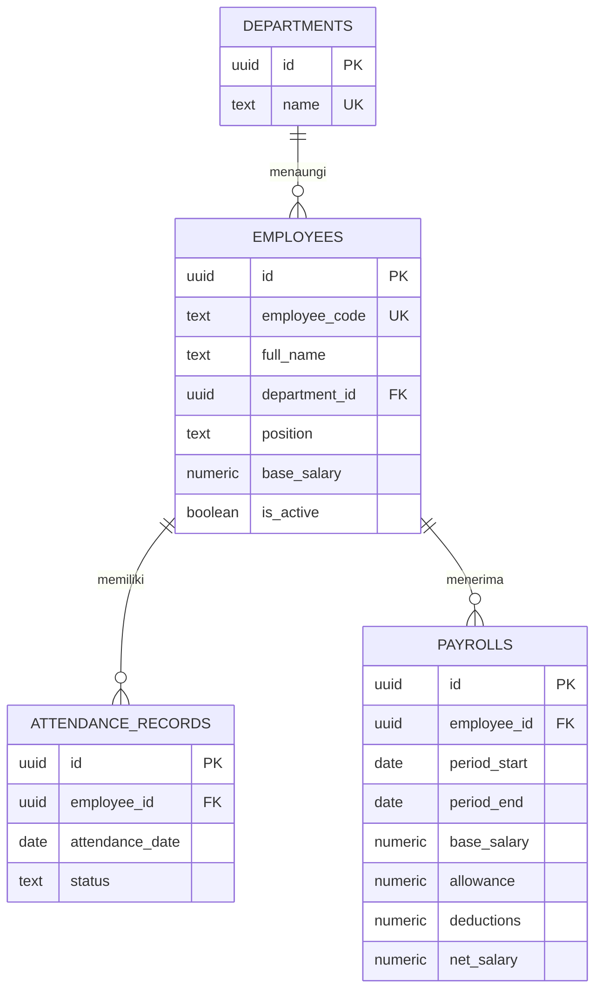

# Ruang Gaji

Aplikasi web penggajian rumah sakit sederhana. Frontend HTML, CSS, dan JavaScript; backend Node.js bawaan; basis data Supabase (PostgreSQL). Tidak memakai `package.json` atau `env.example`.

## Struktur

```text
frontend/
  index.html
  styles.css
  app.js
backend/
  app.js
  schema.sql
```

## ERD



`net_salary` dihitung otomatis oleh PostgreSQL: gaji pokok + tunjangan - potongan. Setiap pegawai hanya memiliki satu catatan kehadiran per tanggal dan satu penggajian untuk periode yang sama.

## Buka langsung di laptop

Klik dua kali `frontend/index.html` atau buka file tersebut dengan browser. Mode ini tidak memerlukan Node.js, Supabase, atau koneksi backend. Data pegawai, kehadiran, dan payroll disimpan pada penyimpanan browser di laptop tersebut.

Mode lokal tidak menyinkronkan data dengan Supabase dan data dapat hilang jika penyimpanan browser dihapus. Gunakan hanya data demo; jangan simpan data pegawai sensitif di mode ini.

## Menjalankan dengan Supabase

1. Di Supabase **SQL Editor**, jalankan isi `backend/schema.sql`.
2. Siapkan Node.js 18 atau lebih baru. Ambil **Project URL** dan **service_role key** dari pengaturan API Supabase. Jangan menaruh service role key di frontend atau membagikannya ke publik.
3. Buka PowerShell dari folder proyek, lalu set konfigurasi untuk sesi terminal saat ini:

   ```powershell
   $env:SUPABASE_URL = "https://PROJECT_REF.supabase.co"
   $env:SUPABASE_SERVICE_ROLE_KEY = "SERVICE_ROLE_KEY"
   node backend/app.js
   ```

4. Buka `http://localhost:3000`.

Server menyajikan frontend dan API pada origin yang sama. Jika koneksi belum tersedia, pastikan SQL sudah dijalankan dan variabel Supabase terisi. API menyediakan daftar/tambah pegawai, catatan kehadiran, serta pembuatan dan daftar penggajian.

> Ini fondasi tugas/demo, bukan sistem payroll produksi. Sebelum dipakai dengan data pegawai sungguhan, tambahkan autentikasi, otorisasi per peran, audit log, dan tinjauan aturan payroll yang berlaku.

## Publikasikan source ke GitHub

GitHub menyimpan source code, tetapi GitHub Pages tidak dapat menjalankan backend Node.js aplikasi ini. Untuk membuat repository:

1. Buat repository kosong di GitHub, tanpa README, `.gitignore`, atau lisensi tambahan.
2. Instal Git, buka PowerShell di folder proyek, lalu jalankan:

  ```powershell
  git init
  git add README.md .gitignore backend frontend
  git commit -m "Initial commit"
  git branch -M main
  git remote add origin https://github.com/USERNAME/NAMA-REPOSITORY.git
  git push -u origin main
  ```

Ganti `USERNAME/NAMA-REPOSITORY` dengan pemilik dan nama repository GitHub. Untuk menjalankan aplikasi secara online, deploy sebagai layanan Node.js pada host yang mendukung backend, lalu atur `SUPABASE_URL` dan `SUPABASE_SERVICE_ROLE_KEY` sebagai environment variables di host tersebut. Jangan commit kunci Supabase.